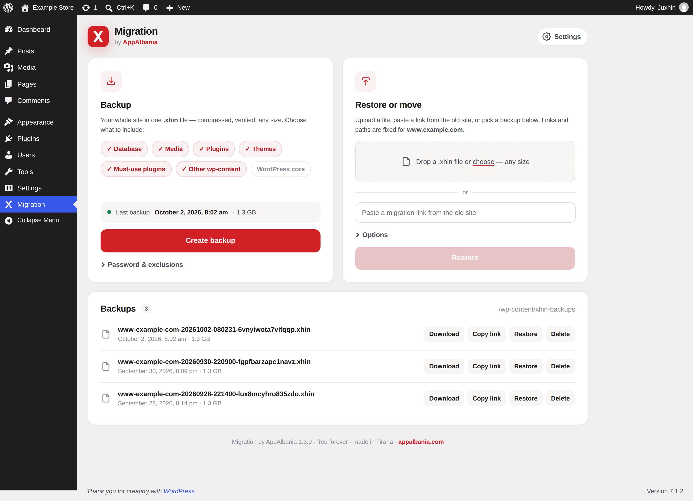
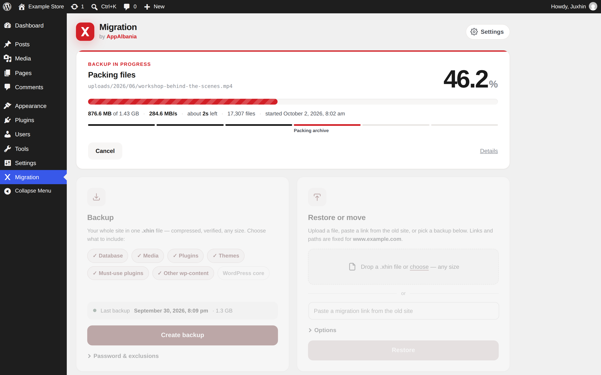
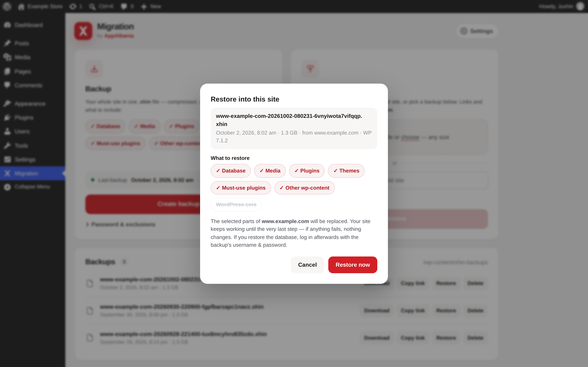
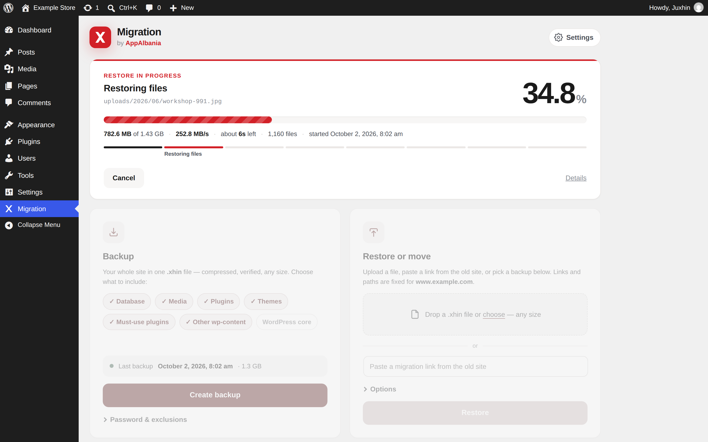
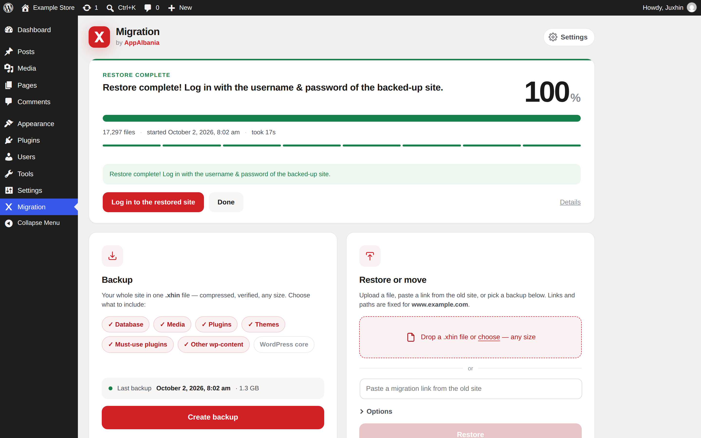
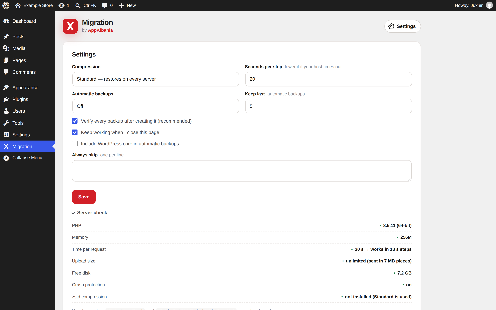

<p align="center">
  
</p>

<h1 align="center">Migration by AppAlbania</h1>

<p align="center">
  Free WordPress <b>backup, restore &amp; migration</b> plugin — your whole site in one <code>.xhin</code> file.<br>
  No size limits · compressed &amp; verified · resumable · built for 150 GB+ sites.
</p>

<p align="center">
  
  
  
  
</p>

---

## What it does

- **Backup** the database, media, plugins, themes, must-use plugins, other `wp-content` and (optionally) WordPress core into one `.xhin` file.
- **Restore** it on the same site, or **move** it to another server: upload the file, or paste a signed, expiring *migration link* from the old site — the new site pulls it server-to-server.
- **Choose what to restore** — any combination of the parts above.
- **URLs and paths are fixed automatically**, including inside serialized data, JSON and URL-encoded values.
- **Real-time progress** — percentage, speed, time left and the file being processed.

## Why it is reliable

| | |
|---|---|
| **Any size** | Everything is streamed in small steps with checkpoints — constant memory, no PHP time-limit or upload-size problems (uploads go in pieces that shrink automatically to fit the server). |
| **Resumable** | A killed request, a dropped connection or a closed browser tab never loses work; the job continues from the last checkpoint (background mode keeps going with the page closed). |
| **Safe restores** | The database is imported into temporary tables and switched in with one atomic `RENAME TABLE`; WordPress core folders are swapped with two folder renames. The site keeps working until the very last step. |
| **Lossless & verified** | Text and SQL are compressed (deflate, or zstd when available); images and video are stored byte-for-byte. Every block has a CRC32, every backup is read back after it is made. Optional AES-256-GCM encryption. |
| **Plays well with others** | All names are prefixed (`AppAlbania_Xhin_`, `APPALBANIA_XHIN_`), no global functions, and backup/restore requests run with other plugins and the theme switched off — a broken plugin cannot stop a migration. |
| **Private on every server** | Backups get random names and job data lives in a folder with an unguessable name, so nothing is reachable from the web even where `.htaccess` is ignored (nginx, OpenLiteSpeed). |

## Tested

Every combination below was tested in both directions — backup on one, restore on another, every file and database row compared afterwards — including WordPress and PHP downgrades and MySQL ⇄ MariaDB collation differences:

| Web server | PHP | WordPress | Database |
|---|---|---|---|
| nginx · Apache · OpenLiteSpeed | 7.4 · 8.0 · 8.1 · 8.2 · 8.5 | 5.9 · 6.0 · 6.2 · 6.5 · 6.8 · 7.1 | MySQL 5.7 · 8.4 · MariaDB 10.6 · 10.11 · 11.4 |

- 42 / 42 cross-server migrations passed (5,544 files and 130,819 database rows verified), with the PHP process killed 84 times on purpose.
- Full migration through the real UI with **35 popular plugins active** (WooCommerce, Elementor, Yoast, Wordfence, Jetpack, LiteSpeed Cache …) — 0 JavaScript errors, same plugins active afterwards.
- Official WordPress.org **Plugin Check: no errors, no warnings**; PHPCompatibility clean for PHP 7.4+; linted on PHP 7.4 → 8.5.

## Screenshots

| | |
|---|---|
|  **Main screen** — backup, restore or move; every backup listed |  **Real-time progress** — %, speed, time left |
|  **Choose what to restore** |  **Restoring** — the site keeps working until the last step |
|  **Restore complete** — URLs and paths already updated |  **Settings & Server check** |

More: [test run with 35 plugins active](docs/screenshots/plugin-heavy-test/) · [earlier versions](docs/screenshots/history/)

## Install

1. Download the latest zip from [Releases](../../releases) (or zip this repository's plugin files).
2. WordPress → **Plugins → Add New → Upload Plugin** → choose the zip → **Install** → **Activate**.
3. Open **Migration** in the admin menu.

## WP-CLI

```bash
wp xhin export                      # back up the whole site
wp xhin export --without=media      # skip parts
wp xhin import site.xhin --yes      # restore
wp xhin verify site.xhin            # check an archive
wp xhin status --resume             # continue a job
```

Very large sites run without any time limit from the command line.

## Repository layout

```
xhin-migration.php     main plugin file
includes/              PHP classes (archive format, database, jobs, storage, admin, CLI)
assets/                admin screen (vanilla JS + CSS, no dependencies)
readme.txt             WordPress.org readme
.wordpress-org/        WordPress.org listing screenshots
docs/screenshots/      all screenshots
.github/workflows/     builds the installable zip for each tagged release
```

## Release

Push a tag like `v1.3.0` — the workflow builds `xhin-migration-1.3.0.zip` (plugin files only) and attaches it to the GitHub release.

## License

GPL-2.0-or-later — see [LICENSE](LICENSE).
Made in Tirana by [AppAlbania](https://appalbania.com).
